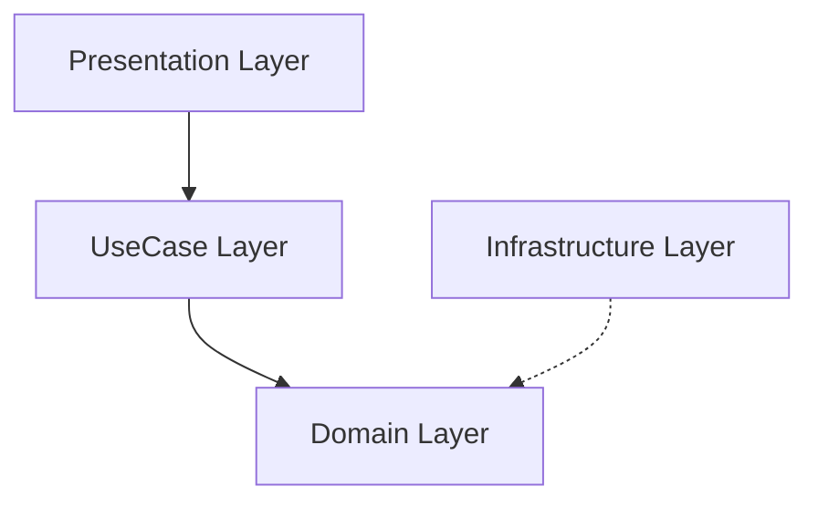

[English](./README.md)

# Watermelon Game Clone

「スイカゲーム」は、落ち物パズルとマージゲームの要素を組み合わせたパズルゲームです  
このクローンはオニオンアーキテクチャとMVPパターンを用いて設計されており、関心の分離が明確になっています

  

<https://github.com/user-attachments/assets/6c3802fb-9c43-45b4-883c-1352ca3f9884>  

## 主なアーキテクチャ上の特徴

オニオンアーキテクチャ + MVPパターン：モジュール性とテストのしやすさを促進

### Domain層

- 目的
  - ゲームのルールやロジックを中心に据えたビジネスロジックを実装
- 依存関係
  - どこにも依存しない（UniRxやUniTaskへの依存は許可）
- 主な責務
  - アイテムのエンティティを生成
  - アイテムのマージ条件を判定
  - スコアを計算
- 構成要素
  - Interfaces：Domain ServiceおよびInfrastructure層のインタフェースを定義
  - Services：Domain Serviceを実装
  - ValueObject：Domain Modelを実装
  - Entity：Domain Modelを実装

### UseCase層

- 目的
  - Domain層のロジックを活用し、ユースケースごとの処理をまとめる
- 依存関係
  - Domain層に依存
- 主な責務
  - Presentation層からのリクエストを受け取り、適切なドメインロジックを実行
- 構成要素
  - Interfaces：UseCaseのインタフェースを定義
  - UseCases：ServiceやRepositoryを利用してUseCaseを実装
  - DTO：Presentation層にDomain層のデータを渡すためのDTOを実装

### Infrastructure層

- 目的
  - 外部データソースや永続化の管理
- 依存関係
  - Domain層に依存
- 主な責務
  - ゲームスコアの保存や読み込み
  - サウンドやリソースのロード
- 構成要素
  - Repositories：Domain ModelやDomain Serviceを利用してリポジトリを実装
  - Services：外部APIなどを利用してサービスを実装
  - SODefinitions：スクリプタブルオブジェクトを定義

### Presentation層

- 目的
  - UI操作やゲームの見た目を管理
- 依存関係
  - Domain層やUseCase層に依存（注意：Domain層への依存は要修正）
- 主な責務
  - Interfaces：Viewのインタフェースを定義
  - Presenter：Presenterを実装（UseCase層とViewのバインド）
  - View：Viewを実装（MonoBehaviourの継承許可）
  - State：各画面状態の定義とそれに対応する状態管理ハンドラを実装
  - DTO：UseCaseのデータをPresenterからViewに渡すDTOを実装
  - SODefinitions：スクリプタブルオブジェクトを定義

### 画面状態管理

ステートパターンを用いてページとモーダルの状態を管理

- PageState / ModalStateを定義
  - PageState：シーン内のPage（メイン画面）のバリエーション
  - ModalState：オーバーレイ的に表示されるModal（サブ画面）のバリエーション
- Dictionaryによる状態ごとのハンドラクラス実装
  - 各ハンドラクラスは「その状態になったときにView(画面)でどのような表示・非表示を行うか」を実装
- UIイベントに応じた状態変更
  - Presenterではユーザー操作やアプリのイベントが発生したときに該当のPageStateやModalStateに切り替え
- ReactivePropertyを使った状態変更の検知と画面切り替え
  - PresenterではPageStateやModalStateが変更されるたびにUpdatePageStateUI() または UpdateModalStateUI()が呼ばれる

## 動作環境

Unity 2022.3.22f1 LTS以降

## 実行方法

1. 本リポジトリをクローンして Unity エディタで開きます
2. Asset Store から Extenject および DOTween を取得（未取得の場合）
3. パッケージマネージャーで「My Assets」から Extenject と DOTween をインポート
4. Extenject に同梱されている AutoSubstitute.zip を TestFramework フォルダに展開
5. Zenject-TestFramework.asmdef および EditMode.asmdef に NSubstitute.dll の参照を追加

## サードパーティ製アセット

- UniRx
  - <https://github.com/neuecc/UniRx>
  - リアクティブプログラミングによるレスポンシブなUIやゲームロジックの実装

- UniTask
  - <https://github.com/Cysharp/UniTask>
  - 効率的な非同期処理の実装

- Extenject
  - <https://assetstore.unity.com/packages/tools/utilities/extenject-dependency-injection-ioc-157735>
  - レイヤー間の依存関係の注入

- DOTween
  - <https://assetstore.unity.com/packages/tools/animation/dotween-hotween-v2-27676>
  - 滑らかなUIアニメーションの実装

- おひさまハミング
  - <https://bgmer.net/music/212>
  - オリジナルファイル名：「212_BPM132」
  - ループ用に編集

## 参考

<https://nosystemnolife.com/suicaclone001/>
