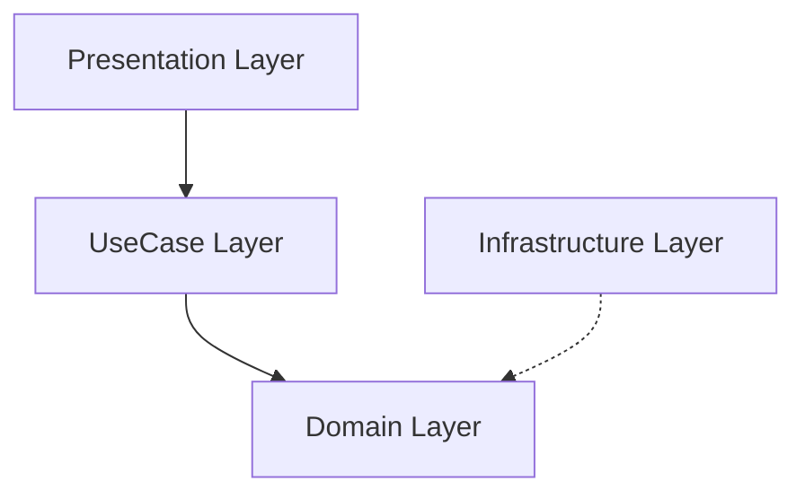

[日本語](./README-ja.md)

# Watermelon Game Clone

"Watermelon Game" is a puzzle game that combines the systems of a falling object puzzle game and a merge game.
This clone is designed using Onion Architecture and the MVP pattern, achieving a clear separation of concerns.

  

<https://github.com/user-attachments/assets/6c3802fb-9c43-45b4-883c-1352ca3f9884>  

## Key Architectural Features

**Onion Architecture + MVP Pattern:** Promotes modularity and testability.

### Domain Layer

- **Purpose**
  - Implements business logic focusing on game rules and core behavior.
- **Dependencies**
  - Independent of all other layers (dependency on UniRx and UniTask is allowed).
- **Main Responsibilities**
  - Generate item entities.
  - Determine merging conditions.
  - Calculate scores.
- **Components**
  - `Interfaces`: Define interfaces for Domain Services and Infrastructure.
  - `Services`: Implement Domain Services.
  - `ValueObject`: Implement domain value objects.
  - `Entity`: Implement domain entities.

### UseCase Layer

- **Purpose**
  - Orchestrates domain logic according to specific use cases.
- **Dependencies**
  - Depends on Domain Layer.
- **Main Responsibilities**
  - Receives requests from the Presentation Layer and executes the appropriate domain logic.
- **Components**
  - `Interfaces`: Define interfaces for use cases.
  - `UseCases`: Implement use cases using Services and Repositories.
  - `DTO`: Data Transfer Objects for passing domain data to the Presentation Layer.

### Infrastructure Layer

- **Purpose**
  - Manages external data sources and persistence.
- **Dependencies**
  - Depends on Domain Layer.
- **Main Responsibilities**
  - Save/load game scores.
  - Load sounds and other resources.
- **Components**
  - `Repositories`: Implement repositories using Domain models/services.
  - `Services`: Use external APIs to implement services.
  - `SODefinitions`: Define ScriptableObjects.

### Presentation Layer

- **Purpose**
  - Handles UI operations and visual representation.
- **Dependencies**
  - Depends on UseCase and (currently) Domain Layer *(note: Domain dependency should be refactored)*.
- **Main Responsibilities**
  - `Interfaces`: Define view interfaces.
  - `Presenter`: Implement presenters to bind UseCase and View.
  - `View`: Implement views (MonoBehaviour inheritance allowed).
  - `State`: Define screen states and their handlers.
  - `DTO`: Pass data from Presenter to View.
  - `SODefinitions`: Define ScriptableObjects.

### Screen State Management

Manages page and modal states using the **State Pattern**.

- **Define PageState / ModalState**
  - `PageState`: Variants of main pages within a scene.
  - `ModalState`: Variants of overlay modal screens.
- **Use Dictionary to map states to handler classes**
  - Each handler class defines how the view should be shown/hidden when entering its state.
- **State transition triggered by UI events**
  - Presenter changes `PageState` or `ModalState` based on user interactions or app events.
- **State change detection and screen update using ReactiveProperty**
  - Presenter calls `UpdatePageStateUI()` or `UpdateModalStateUI()` whenever `PageState` or `ModalState` changes.

## Environment

Unity 2022.3.22f1 LTS or later

## How to Run

1. Clone this repository and open it in Unity editor
2. Get Extenject and DOTween in the Asset Store (if you haven't already)
3. Select "My Assets" in the package manager and apply Extenject and DOTween
4. Extract the AutoSubstitute.zip shipped with Extenject to the TestFramework folder
5. Add reference to NSubstitute.dll in Zenject-TestFramework.asmdef and EditMode.asmdef

## Third Party Assets

- **UniRx**
  - <https://github.com/neuecc/UniRx>
  - Enables reactive UI and game logic using reactive programming.

- **UniTask**
  - <https://github.com/Cysharp/UniTask>
  - Provides efficient asynchronous programming.

- **Extenject**
  - <https://assetstore.unity.com/packages/tools/utilities/extenject-dependency-injection-ioc-157735>
  - Injects dependencies between layers.

- **DOTween**
  - <https://assetstore.unity.com/packages/tools/animation/dotween-hotween-v2-27676>
  - Creates smooth UI animations.

- **Ohisama Humming**
  - <https://bgmer.net/music/212>
  - Original filename: "212_BPM132"
  - Edited for looping.

## References

<https://nosystemnolife.com/suicaclone001/>
